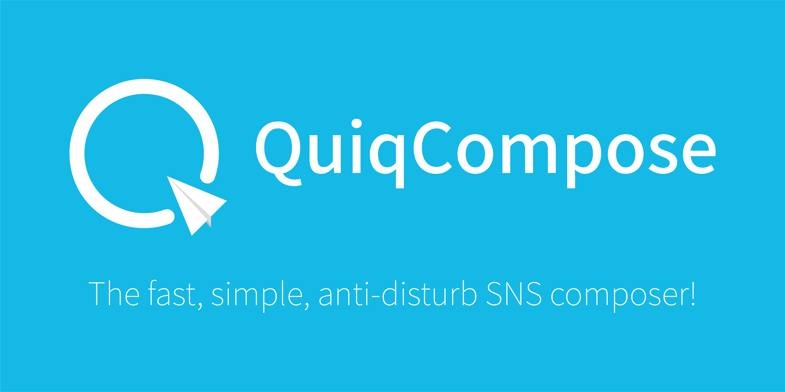

 

# 참고!!
QuiqCompose의 데스크톱 앱(WPF) 개발은 잠정 중단합니다. 현재 QuiqCompose를 웹 앱으로 다시 제작할 계획이 있습니다.

# QuiqCompose (OSS)
이 프로그램은 트윗 작성에 집중하게 해주면서도 간단한 UI로 빠르고 간편한, ~~트잉질 들킬 염려 없는~~ 트윗 작성 경험을 제공하는 WPF 프로그램입니다.

  + 버전에 따른 변경 사항은 [이 문서](CHANGELOG.md)를 참고해주세요.

# 다운로드
[여기!!](https://github.com/SDSkyKlouD/QuiqCompose-OSS-WPF/releases)에서 최신 릴리즈를 다운로드 받으세요.

# 라이선스
[MIT License](LICENSE.md)
